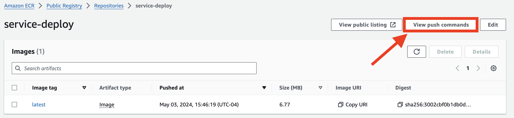
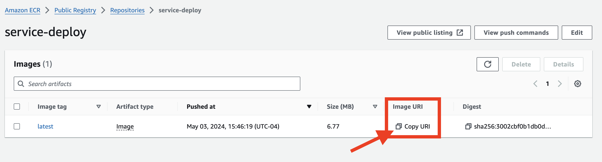
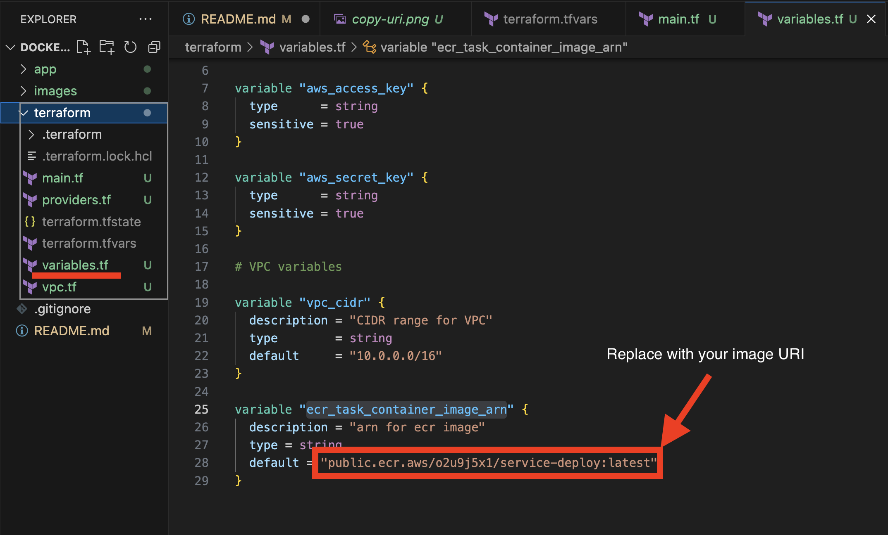
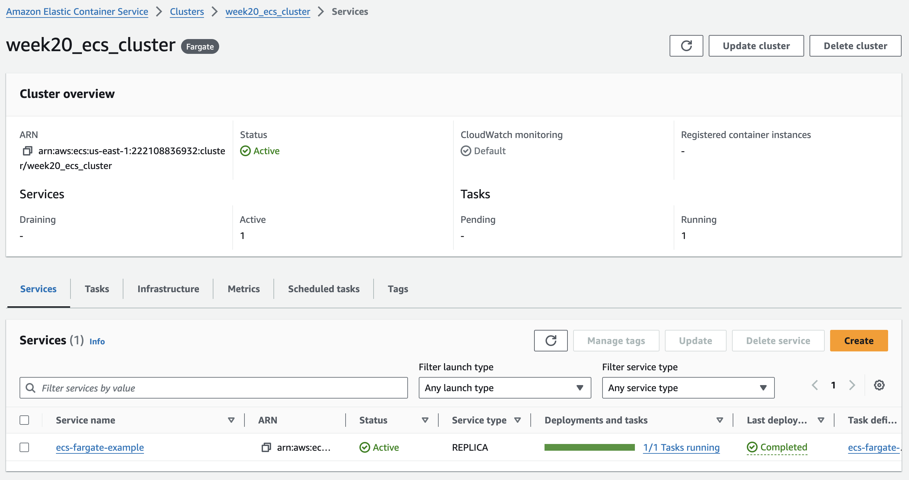

# AWS Docker Deployment Using Terraform

This repository contains the Terraform configuration files needed to deploy a docker container for a simple Go webserver to AWS ECS.

## Overview

The configurations provided here set up the necessary AWS resources to run Docker containers in a scalable and secure environment. This includes provisioning VPCs, subnets, security groups, ECS clusters, and task definitions.

## Prerequisites

Before you begin, ensure you have the following: 
- [AWS Account](https://aws.amazon.com/console/) and AWS CLI configured with appropriate credentials: [AWS CLI Download Guide](https://docs.aws.amazon.com/cli/latest/userguide/getting-started-install.html)
- Terraform installed (version 0.12.x or later recommended): [Terraform Download Guide](https://developer.hashicorp.com/terraform/install)
- Docker installed if you need to build Docker images or push them to ECR: [Docker Download Link](https://www.docker.com/products/docker-desktop/)

## Repository Structure

- `/app`: contains index.html and main.go file to create a simple file server, along with dockerfile to run a containerized version of the application.

- `/terraform`: contains the terraform files responsible for configuring and creating AWS resources to deploy the docker server to the cloud.
    - `providers.tf` - lists aws and docker as providers for terraform
    - `main.tf` - creates the ECS cluster, services, and task_definition to run the docker container on AWS
    - `variables.tf` - defines variables for sensitive info like access keys, and non-sensitive info like aws-region, ECR image arn, etc.
    - `vpc.tf` - Configures the VPC, subnets, and other networking resources using terraform vpc module.

## Getting Started

### Setup Instructions

1. **Clone the Repository**

   ```bash
   git clone https://github.com/jfs325/aws-docker-deploy.git
   cd aws-docker-deploy

2. **Ensure docker container runs locally**

    It's good practice to test locally before you push code out into the real world, so run these commands to make sure everything works:

        cd app 
    to change into the application directory
    
        docker build local-testing . 
    to build your container image

        docker run -p 8000:8000 local-testing 
    to run the image and expose the correct ports for accessing the application
    
        curl http://localhost:8000
    to test access to local application, you should recieve some html code back

    If that went smoothly, then you're ready to move on.

3. **Create `terraform.tfvars` file in /terraform directory**

    Once you have your repo up and running in an IDE, you should create this file in the `/terraform` folder and enter your aws access and secret key. If you don't do this, you will have to repeatadely enter your key variables when running terraform commands. Make sure to keep it included in the .gitignore file so you don't expose you access keys!

    Follow this format:

        aws_access_key = "enter-access-key-here"
        aws_secret_key = "enter-secret-key-here"

4. **Create an ECS container repo and push your docker image to it**
    
    This is the one creation part I do manually, because pushing your local docker image to ECR cannot be easily automated here.

    To do this, go to ECR in the [AWS Console](https://aws.amazon.com/console/), and click on "Create repo"

    ## IMPORTANT IF YOU HAVE AN APPLE CHIP MAC
        
    If you are using an M1 Mac or above, mismatched architecture types can cause some headaches with containers. 
    
    The default architecture docker will run is ARM64 on your local machine, which is different than the default AMD64 for ECS services.

    If you want to change the docker file for your own purposes, make sure to include
        
        FROM --platform=linux/amd64 
    
    in your dockerfile when defining architecture types. I believe this is easier than configuring multiple AWS resources to run ARM64 for your default local architecture. 
    
    Name your repo, and create it.

    To push your local docker image to your ECR repo, click on your container repository you just created, and click on the 'view push commands' button:

     

    And run the following commands in your local repo. I added the keyword `--platform=linux/amd64` when building the docker image just to be safe with M1 architecture types.

    Once you pushed your repo to ECR, then you should copy the cloud Image URI:

    

    And paste it into the `variables.tf` file in the /terraform repo:

    


5. **Running terraform commands**

    If you've done the above steps correctly, you should be ready to work some magic with terraform commands.

    If you're still in the /app folder, run this to switch to the terraform folder:
    
        cd ..  
        cd terraform

    Then run 
    
        terraform init 
    to initiate your terraform module

    
    
    Next, run 
        
        terraform plan 
    to preview your terraform code and see if there's any errors
        

    If everything looks good, then run 
    
        terraform apply
    to create your AWS resources

6. **Checking your ECS task_definition** 
    
    If your `terraform apply` ran smoothly, then you're ready to check out your container in the cloud!

    1. Go to ECS in the AWS Console

    2. Click on your cluster, and then you should see that your ECS service and task_definition are running:



