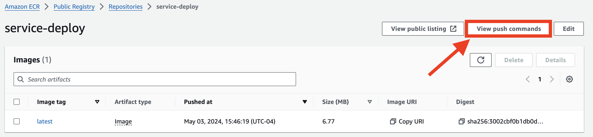
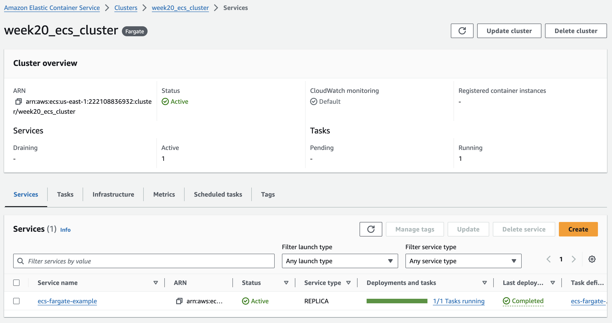

# AWS Docker Deployment using Terraform

This repository contains the Terraform configuration files needed to deploy a simpe Go webserver application served by Docker containers on AWS ECS using Fargate.

## Overview

The configurations provided here set up the necessary AWS resources to run Docker containers in a scalable and secure environment. This includes provisioning VPCs, subnets, security groups, ECS clusters, and task definitions.

## Prerequisites

Before you begin, ensure you have the following: 
- AWS Account and AWS CLI configured with appropriate credentials: [AWS CLI Download Guide](https://docs.aws.amazon.com/cli/latest/userguide/getting-started-install.html)
- Terraform installed (version 0.12.x or later recommended): [Terraform Download Guide](https://developer.hashicorp.com/terraform/install)
- Docker installed if you need to build Docker images or push them to ECR: [Docker Download Link](https://www.docker.com/products/docker-desktop/)

## Repository Structure

- `providers.tf` - lists aws and docker as providers for terraform
- `main.tf` - creates the ECS cluster, services, and task_definition to run the docker container on AWS
- `variables.tf` - defines variables for sensitive info like access keys, and non-sensitive info like aws-region, ECR image arn, etc.
- `vpc.tf` - Configures the VPC, subnets, and other networking resources using terraform vpc module.

## Getting Started

### Setup Instructions

1. **Clone the Repository**

   ```bash
   git clone https://github.com/jfs325/aws-docker-deploy.git
   cd aws-docker-deploy

2. **Create terraform.tfvars file**

    This is where you will enter your aws access key and secret key, to be used by terraform. If you don't create this, you will have to repeatadely enter your key variables when running terraform commands. Make sure to keep it included in the .gitignore file so you don't expose you access keys!

    Mine looks something like this:

    aws_access_key = "enter-access-key-here"
    aws_secret_key = "enter-secret-key-here"

3. **Create an ECR docker repo in AWS console**
    This is the one part I do manually, because pushing your local docker file to ECR cannot be easily automated here.

    To do this, go to ECR in the AWS Console, and click on "Create repo"

    # IMPORTANT IF YOU HAVE AN APPLE CHIP Mac
        If you are using an M1 Mac or above, mismatched architecture types can cause some headaches with containers. 
        
        The default architecture docker will run is ARM64 on your local machine, which is different than the default AMD64 for ECS services.

        If you want to change the docker file for your own purposes, make sure to included `FROM --platform=linux/amd64` in your dockerfile when defining architecture types. I believe this is easier than configuring multiple AWS resources to run ARM64 for your default local architecture. 
    
    Name your repo, and create it.

    To push your local docker image to your ECR repo, click on the 'view push commands' button:

     

    And run the following commands in your local repo. I added the keyword --platform=linux/amd64 when building the docker image just to be safe.

4. **Running terraform commands**

    If you've done the above steps correctly, you should be ready to run some terraform commands to work some magic.

    First run `terraform init` to initiate your terraform module

    Then run `terraform plan` to simulate running your terraform code and see if there's any errors

    If everything looks good, then run `terraform apply` to create your AWS resources


5. **Checking your ECS task_definition** 
    If your `terraform apply` ran smoothly, then you're ready to check out your container in the cloud!

    1. Go to ECS in the AWS Console

    2. Click on your cluster, and then you should see that your ECS service and task_definition are running:



